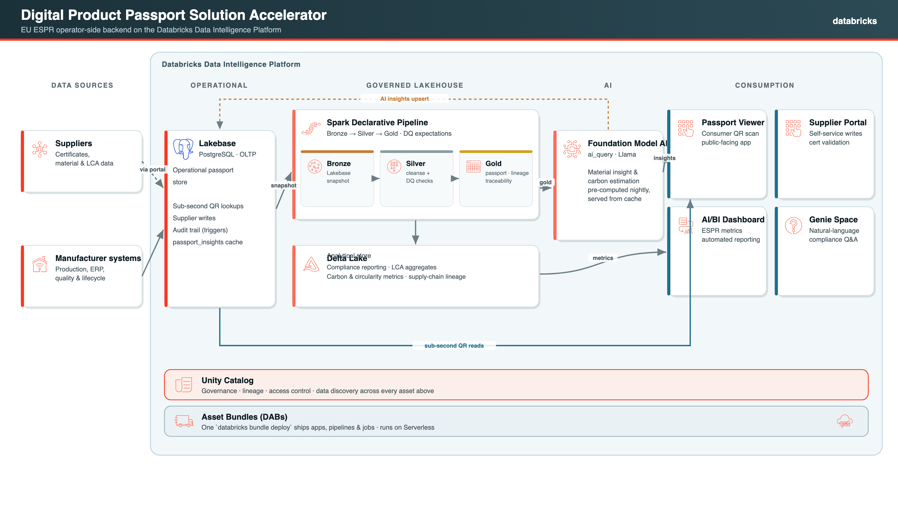

# Digital Product Passport (DPP) Solution Accelerator

A modular, reusable solution accelerator demonstrating how manufacturers can build
EU-compliant Digital Product Passports on the **Databricks Data Intelligence Platform**
with **Lakebase** as the operational backbone.

## Why This Matters

The EU Ecodesign for Sustainable Products Regulation (ESPR) mandates Digital Product
Passports, with batteries first (mandatory 18 Feb 2027), then iron & steel,
textiles, aluminium, tyres, furniture and further groups through the end of the
decade. Manufacturers must provide machine-readable, per-product lifecycle data
covering origin, materials, environmental impact, compliance, circularity, and
disposal.

The EU system is **decentralized**: the Commission runs a thin registry/portal +
standards, but the passport data is held and served by each **economic operator**.
This accelerator is that operator-side backend. See
[docs/positioning.md](docs/positioning.md) for the regulatory driver, the EU
architecture, and where this fits.

> **Scope of this accelerator.** v1.0 is a reference architecture and runnable
> demo, not a turnkey compliance product. In particular it serves passport data
> openly and does not yet implement the regulation's tiered access rights
> (public / restricted / authority-only) or DPP Registry registration and the
> Registry-issued unique identifier. Those are on the [roadmap](ROADMAP.md). The
> economic operator remains responsible for meeting the applicable legal
> requirements.

## Why Databricks

A DPP is not one workload — it is operational lookups, batch analytics, AI, and
secure sharing over the same governed data. Databricks lets a manufacturer build
the whole operator-side backend on **one platform**, instead of stitching
together a transactional database, a warehouse, an app host, and an AI service:

- **Lakebase** serves sub-second QR/passport lookups and supplier writes — OLTP
  next to the lakehouse, no separate operational database to integrate.
- **Unity Catalog** governs every layer (lineage, access, audit) — the basis for
  the public vs. restricted data tiers the regulation requires.
- **Spark Declarative Pipelines, AI Functions, Genie, Databricks Apps** cover
  ingestion, compliance analytics, AI insights, and the consumer/supplier apps.
- **Delta Sharing** addresses cross-company value-chain and cross-border data
  exchange without copying data.

One governed copy of the data, many workloads — which is hard to match by
assembling point products.

## Architecture

The solution uses a hybrid OLTP + analytics architecture:

- **Lakebase (PostgreSQL)** -- Operational store for per-product passport lookups,
  supplier data entry, compliance updates, audit trail writes, and the cached
  AI-insights serving table.
- **Spark Declarative Pipelines (SDP)** -- Snapshot ingestion from Lakebase into Bronze
  streaming tables, Silver conformance layer, and Gold business aggregates
  (passport-complete, multi-tier supplier traceability, carbon, compliance gaps,
  material composition trends, circularity metrics).
- **Databricks Apps** -- Consumer-facing passport viewer and supplier self-service portal,
  each bound to the Lakebase instance as a resource (service-principal auth).
- **AI/BI Dashboard** -- 4-page compliance and sustainability dashboard.
- **Genie Space** -- Natural language SQL exploration for compliance officers.
- **Foundation Model API** -- AI passport insights, pre-computed nightly via
  `ai_query` into `gold.dpp_passport_insights` and served from Lakebase cache.



> Diagram source: [`docs/architecture.svg`](docs/architecture.svg) (scalable vector,
> official Databricks icons; the PNG is rendered from it). A simplified
> [`docs/architecture.mmd`](docs/architecture.mmd) Mermaid version is also included.

## Modules

| Module | Status | Description |
|--------|--------|-------------|
| **1. Foundation** | Complete | Lakebase schema (12 tables incl. multi-tier `parent_supplier_id` + insights cache), deterministic synthetic data (500 products, 50 suppliers across 3 tiers), self-contained setup job (apply schema + seed via runtime OAuth) |
| **2. Passport Viewer** | Complete | Consumer-facing app with 7 tabs (Origin incl. upstream supplier chain, Materials, Environment, Compliance, Circularity, Disposal, AI Insights), QR codes, category filters, search, pagination |
| **3. Dashboard & Genie** | Complete | 4-page AI/BI compliance dashboard, Genie Space with curated questions |
| **4. Supplier Portal** | Complete | Supplier self-service app with cert renewal (Lakebase writes), audit log, search/filter |
| **5. AI/ML Enrichment** | Complete | AI passport insights (gap detection, carbon analysis, compliance alerts, circularity recommendations) pre-computed nightly via `ai_query` and served from Lakebase cache, with a live Foundation Model fallback |

## Databricks Products Showcased

| Product | Role |
|---------|------|
| **Lakebase** | Operational passport store, supplier writes, audit trail |
| **Spark Declarative Pipelines** | Data ingestion and transformation (Bronze/Silver/Gold) |
| **Unity Catalog** | Data governance, lineage, DQ expectations |
| **Databricks Apps** | Passport Viewer + Supplier Portal |
| **AI/BI Dashboards** | Compliance and sustainability reporting |
| **Genie** | Natural language querying for compliance officers |
| **Foundation Model API** | Real-time AI passport analysis |
| **DABs** | Deployment and CI/CD |

## Adapting to your industry

The schema, SDP pipeline, apps, dashboard, and Genie space are **domain-agnostic** —
the six DPP categories (origin, materials, environmental impact, compliance,
circularity, disposal) are exactly what the EU ESPR mandates for *every* product
group. Only the **synthetic data** is industry-specific, and it is driven by a
selectable **profile**:

| Profile | Manufacturer | Categories | Example regulations |
|---------|--------------|------------|---------------------|
| `battery` (default) | VoltCore Energy AB | EV / Industrial / LMT / Portable Battery | **EU Batteries Regulation 2023/1542**, ESPR, UN 38.3; carbon footprint / recycled content / due diligence phased in post-2027 |
| `furniture` | NordicForm AB | Furniture, Textiles, Lighting, Storage | ESPR, REACH, RoHS, Timber |

The **battery** profile is the default: the battery passport is the first
mandatory EU Digital Product Passport (18 Feb 2027), so it is the highest-impact
lead. It models item-level passports, multi-tier `mine → cell → module → pack`
traceability, and battery **state of health** (dynamic data). Switch to
`furniture` with `--var profile=furniture` at deploy time.

Pick a profile at **deploy** time — the profile is baked into the setup job's
parameters when the bundle is deployed, so passing `--var` to `bundle run`
alone has no effect:

```bash
databricks bundle deploy -t dev --var="profile=battery" --var="dashboard_warehouse_id=<warehouse-id>"
databricks bundle run synthetic_data_setup -t dev
```

To add your own industry (medical devices, textiles, electronics, …), add a new
entry to `PROFILES` in `src/foundation/02_synthetic_data_generator.py` — product
catalog, materials, certifications, carbon ranges, lifecycle splits, regulations,
disposal components — and select it with `--profile`. No schema or app changes
needed. The [EU battery DPP requirements](https://single-market-economy.ec.europa.eu/events/digital-product-passport-batteries-2026-05-27_en)
map directly onto the existing six categories.

> Deeper battery-passport features (tiered access control, daily State-of-Health
> dynamic data, full Annex XIII technical parameters, value-chain aggregation) are
> intentionally out of scope for v1.0 and captured in [ROADMAP.md](ROADMAP.md),
> each mapped to the relevant EU requirement and Databricks capability.

## Quick Start

### Option A — Deploy from the Databricks UI (Asset Bundle Editor)

The fastest path, matching the standard Solution Accelerator flow:

1. Clone this repository into your Databricks Workspace (Git folder / Repos).
2. Open the **Asset Bundle Editor** in the Databricks UI.
3. In the editor's **variables** panel, set **`dashboard_warehouse_id`** to a SQL
   warehouse in your workspace (find it under SQL Warehouses; the default is a
   placeholder and the dashboard will not render until you set this).
4. Click **Deploy** — this provisions the pipelines, jobs, dashboard, and both apps.
5. In the **Deployments** tab (🚀), **Run** these in order: the `synthetic_data_setup`
   job, then the `dpp_ingestion_pipeline`, then (optional, for the viewer's AI
   Insights tab) the `precompute_insights` job.
6. (Optional) Create the Genie space by hand (step 9 of Option B) — the dashboard
   and apps work without it.

> One prerequisite the UI flow can't do for you: a **Lakebase instance** must exist.
> Create it once from a terminal:
> `databricks database create-database-instance dpp-passport --capacity CU_2`.
> Unlike the notebook-style accelerators, this one is **DAB-native** — apps, a Spark
> Declarative Pipeline, and jobs rather than a notebook chain. Without the
> `precompute_insights` run in step 5 the app works fully except the AI Insights
> tab, which shows a "generated on a schedule" note until the cache is populated.

### Option B — Deploy from the CLI (full control)

### Prerequisites

- Databricks CLI >= 0.278.0
- Python >= 3.10
- Access to a Databricks workspace with Lakebase enabled
- Unity Catalog with a catalog for pipeline output

> **CLI version gotcha:** an old `databricks` CLI (v0.18, installed via pip years
> ago) is often first on `PATH` and its `auth login` does not complete the modern
> OAuth flow. Run `databricks version` to check; if it isn't >= 0.278, call the
> new binary explicitly (`/usr/local/bin/databricks`) or fix your PATH.

### Setup

1. Clone this repository:
   ```bash
   git clone <repo-url>
   cd dpp-solution-accelerator
   ```

2. Authenticate to your workspace with OAuth (no tokens/secrets needed) and point
   the bundle at that profile:
   ```bash
   databricks auth login --host https://<your-workspace>.cloud.databricks.com --profile <name>
   export DATABRICKS_CONFIG_PROFILE=<name>   # or pass -p <name> to bundle commands
   ```

3. Create the Lakebase instance (`--enable-pg-native-login` is only needed for
   the native-login fallback; the apps use the resource binding by default):
   ```bash
   databricks database create-database-instance dpp-passport --capacity CU_2
   ```

4. Deploy the bundle. This ships the pipelines, the setup job, the dashboard,
   **and both apps** — the apps are in `resources/apps.yml` and bound to the
   Lakebase instance as a resource (no separate `databricks apps deploy
   --source-code-path` step). Pass your SQL warehouse for the dashboard:
   ```bash
   databricks bundle deploy -t dev --var="dashboard_warehouse_id=<warehouse-id>"
   ```

5. Apply the schema, generate data, and seed Lakebase — **one self-contained
   job task** (`00_setup_lakebase.py`) that runs in a single process and
   self-authenticates with a short-lived OAuth token (no secret, no hand-created
   PG user). The DDL also grants the apps' service-principal roles read/write
   on the `dpp` schema, so there is no manual GRANT step:
   ```bash
   databricks bundle run synthetic_data_setup -t dev
   ```
   > Local alternative: set `LAKEBASE_HOST` / `LAKEBASE_USER` /
   > `LAKEBASE_PASSWORD` and run `python src/foundation/00_setup_lakebase.py`.

6. Run the ingestion pipeline (Bronze / Silver / Gold):
   ```bash
   databricks bundle run dpp_ingestion_pipeline -t dev
   ```

7. Start the apps (deploys the source version and starts the app):
   ```bash
   databricks bundle run dpp_passport_viewer -t dev
   databricks bundle run dpp_supplier_portal -t dev
   databricks apps list   # grab the app URLs
   ```

8. (Optional) Pre-compute AI insights so the viewer serves them from cache:
   ```bash
   databricks bundle run precompute_insights -t dev
   ```

9. (Optional) Create the Genie space. Genie spaces are not a native DAB
   resource type yet, so the bundle does not deploy one;
   `resources/genie/dpp_compliance_explorer.yml` is the version-controlled
   spec. In the workspace UI go to **Genie > New**, attach the Gold/Silver
   tables listed in the spec (with your catalog/schema substituted for
   `${var.catalog}.${var.schema}`), and paste in its description and curated
   questions — or create it programmatically via the Genie REST API. The
   dashboard and apps work without it; only the Genie demo scenarios need it.

### Deployment notes (verified on a fresh workspace)

- **SQL warehouse** — `dashboard_warehouse_id` has no universal default; pass
  your own (`databricks warehouses list`).
- **Upgrading an existing deployment** — re-run the setup job before the
  pipeline. The schema DDL is idempotent (`CREATE ... IF NOT EXISTS`, additive
  `ALTER TABLE`), and the pipeline reads tables the setup job creates, so a
  pipeline run against a pre-upgrade Lakebase schema will fail on missing
  tables/columns.
- **Catalog** — the pipeline writes to `${var.catalog}` (default `dpp_dev`). If
  you can't create that catalog (no `CREATE CATALOG`, or Default Storage), point
  at an existing one: `--var="catalog=<your_catalog>"`. **Then also edit the
  catalog in `resources/dashboards/dpp_compliance.lvdash.json`** — DABs does not
  substitute bundle variables inside dashboard files.
- **Lakebase database** — defaults to the instance's built-in
  `databricks_postgres`, so no database needs to be created. Override with
  `--var="lakebase_database=<name>"` if you provisioned a custom one.
- **App auth** — each app binds the Lakebase instance as a resource; Databricks
  injects `PGHOST/PGUSER/PGDATABASE` and the app mints a short-lived OAuth token
  for the password using its own service principal (no secret).
- **Grants** — the DDL grants to `PUBLIC` (demo-grade). For production, scope
  least-privilege grants to each app's `PGUSER`.

> **Fallback: PG native login.** If you cannot use a resource binding (e.g.
> local dev), create the instance with `--enable-pg-native-login`, create a
> `dpp_app_user` with a password, store the password in a secret scope, and set
> `LAKEBASE_USER` + `LAKEBASE_PASSWORD` (`valueFrom: <scope>/<key>`) in each
> `app.yaml`. The app falls back to this path automatically when `PGHOST` is
> not injected.

## Project Structure

```
dpp-solution-accelerator/
  databricks.yml              DAB root config + variables + targets
  resources/                  DAB resources: pipelines, jobs, apps, dashboards
  src/
    foundation/               00 setup (schema+generate+seed), 01 DDL, 02 generator, 03 seeder
    pipelines/                SDP code: bronze / silver / gold + precompute_insights
    serving/                  Reyden toggle (reference pattern)
    apps/
      passport_viewer/        Consumer-facing passport app (FastAPI + Jinja2)
      supplier_portal/        Supplier self-service portal (FastAPI + Jinja2)
  tests/                      Unit tests (pytest)
  docs/                       architecture.svg/.png (diagram) + architecture.mmd (Mermaid)
  LICENSE.md  NOTICE.md  SECURITY.md  CONTRIBUTING.md  CHANGELOG.md  ROADMAP.md
```

## Multi-tier supply chain traceability

Suppliers form a hierarchy via `supplier.parent_supplier_id`: a tier-2 supplier's
parent is the tier-1 (direct) supplier it delivers to, and tier-3 rolls up to
tier-2. This models the tier-1 → tier-N question regulators and OEMs ask
("where does this component ultimately come from?").

- **Schema**: self-referential FK on `dpp.supplier`.
- **Gold**: `gold_supplier_traceability` flattens each supplier's full ancestry
  (bounded iterative parent walk).
- **App**: the Passport Viewer's Origin tab renders the upstream chain per
  component via a recursive CTE.

## Production hardening

This accelerator uses **snapshot ingestion** (full Lakebase → Bronze read per
pipeline run) for simplicity. For production scale, replace it with continuous
change data capture:

- **Lakebase Sync / reverse ETL** to keep the operational store and the lakehouse
  aligned without full snapshots.
- **Lakeflow Connect (CDC)** for incremental change capture from the source systems.
- Use **secrets + least-privilege Postgres roles** (the apps already support a
  native-login fallback), schedule the pre-compute job, and pin model/runtime versions.
- Consider **Reyden** (high-concurrency serving, optional toggle in `src/serving/`)
  for sub-second QR lookups at scale.

## App access logging (optional)

To track who opens the apps internally, set `ACCESS_LOG_ENABLED=true` in each
app's `app.yaml`. When on, both apps record the accessing user (from the
Databricks Apps SSO `X-Forwarded-*` headers), path, and timestamp to
`dpp.app_access_log`. It is **off by default**: user emails are personal data
(GDPR), so enable it only where appropriate and with the right notices. View
the data by querying the Lakebase table directly, or surface it in the AI/BI
dashboard. Note this logs *authenticated app usage*; requests from users who
lack access are handled by Databricks before reaching the app and are not
recorded here.

## EU ESPR Timeline

Dates below reflect the European Commission's
[DPP overview](https://single-market-economy.ec.europa.eu/single-market/digital-product-passport_en)
(product-group dates are set by the individual ESPR delegated / sector acts and
continue to move; treat them as indicative and confirm against the act that
applies to you).

- **20 July 2026:** EU central DPP Registry operational.
- **Q4 2026:** Iron & steel ESPR delegated act (one of the earliest groups).
- **18 Feb 2027:** Mandatory battery passports (EV, light-transport, industrial).
- **Q2 2027:** Implementing Act for Unique Identifiers (the Registry-issued URI).
- **Q2 2027:** Construction products (Construction Products Regulation).
- **2027 (H2):** Textiles, aluminium, tyres (ESPR delegated acts).
- **2028:** Furniture. **2029:** Mattresses; recycled-content rules.
- Toys and detergents come in through their own legislation (e.g. Toys Safety
  Regulation 2025/2509), not the ESPR delegated acts above.

**Regulatory references** (external, authoritative sources — for context only):

- European Commission — [Digital Product Passport overview](https://single-market-economy.ec.europa.eu/single-market/digital-product-passport_en)
- Ecodesign for Sustainable Products Regulation (ESPR) — [Regulation (EU) 2024/1781](https://eur-lex.europa.eu/eli/reg/2024/1781/oj)
- EU Batteries Regulation — [Regulation (EU) 2023/1542](https://eur-lex.europa.eu/eli/reg/2023/1542/oj)

> This accelerator is an independent Databricks solution accelerator. It is **not
> affiliated with, endorsed by, or produced in association with** the European
> Commission or any EU body. Links above are provided as references to the
> primary regulation and official guidance; always confirm requirements against
> the acts that apply to you.

## Target Audience

Any organization that must place an EU Digital Product Passport on the market,
and the Databricks field and partner teams who support them:

- **Manufacturers, brands, and importers** across all in-scope ESPR categories
  (batteries first, then textiles, furniture, tyres, electronics, iron and steel,
  aluminium), whether based in the EU or selling into it.
- **Solutions Architects, Delivery Solutions Architects, and partners** building
  DPP solutions on the Databricks Data Intelligence Platform.

Originally incubated in the Databricks Manufacturing Community of Practice
(MFG CoP), now applicable to any EU DPP operator-side use case worldwide.

## Dependencies and licenses

All third-party libraries are permissively licensed (Apache-2.0 / BSD / MIT).
The data generator (Faker) and all pipeline/app code run on Databricks
Serverless + Unity Catalog.

| Library | Purpose | License |
|---------|---------|---------|
| faker | Synthetic data generation | MIT |
| fastapi | App web framework | MIT |
| uvicorn | ASGI server | BSD-3-Clause |
| jinja2 | App templating | BSD-3-Clause |
| qrcode[pil] | QR codes (Pillow) | BSD / HPND |
| requests | HTTP (OAuth token mint) | Apache-2.0 |
| databricks-sdk | Databricks API | Apache-2.0 |
| pyspark / Lakeflow | Pipelines (runtime-provided) | Apache-2.0 |
| asyncpg | Lakebase (PostgreSQL) connectivity | Apache-2.0 |

## Contributing

See [CONTRIBUTING.md](CONTRIBUTING.md). Contributions are accepted pursuant to a CLA.

## Maintenance

- **Maintainer:** Daniel Dahlin ([@danielvelasquez123-dbx](https://github.com/danielvelasquez123-dbx)).
- **Support:** please open a [GitHub Issue](../../issues) for bugs, questions, or
  enhancement requests. Issues are triaged by the maintainer.
- **Validation cadence:** the end-to-end deploy (bundle deploy, pipelines, apps,
  dashboard, Genie) is re-validated **quarterly** and whenever a new Databricks
  Runtime LTS is released, on a fresh workspace with Serverless + Unity Catalog.
- **Automated checks:** unit tests and a byte-compile run on every push/PR and on
  a **weekly schedule** (see [`.github/workflows/ci.yml`](.github/workflows/ci.yml))
  to catch dependency or platform drift between manual validations.
- **Deprecation:** if the accelerator can no longer be maintained, a notice will be
  added here and to [CHANGELOG.md](CHANGELOG.md) before the repository is archived.

## License

&copy; 2026 Databricks, Inc. Licensed under the Databricks License — see
[LICENSE.md](LICENSE.md). Use is permitted in connection with your use of the
Databricks Platform Services. See [CHANGELOG.md](CHANGELOG.md) for release notes.
